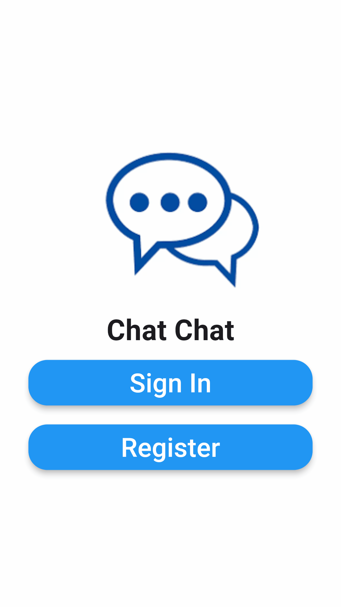

# Flutter Chat App

## Description
This Flutter chat app allows users to communicate in real time. It uses Firebase for authentication and Cloud Firestore for real-time message storage.
 using a firestore and learned somethings about it
 use a stream builder to show all things in moment that occur
 build a message widget as a reusable widget to help to show message
 fix some issues
  
!Chat App Screenshot

## Installation
1. Make sure you have Flutter and Dart installed. If not, follow the official installation guide.
2. Clone this repository: `git clone https://github.com/ZakariaAshraf/Chat-App.git`
3. Navigate to the project directory: `cd flutter-chat-app`
4. Install dependencies: `flutter pub get`
5. Set up Firebase:
    - Create a new project on the Firebase Console.
    - Add an Android app to your project and download the `google-services.json` file.
    - Place these files in the respective directory (`android/app`).
6. Start the app: `flutter run`

## Usage
- Open the app on your emulator or physical device.
- Sign in with your Google account (authentication is handled by Firebase).
- Join a chat room or create a new one.
- Start sending messages!

## Features
- Real-time messaging: Messages are synced across devices in real time.
- User authentication: Firebase handles user authentication using Google Sign-In.
- Message persistence: Messages are stored in Cloud Firestore.

## Contributing
Contributions are welcome! If you'd like to contribute, follow these steps:
1. Fork this repository.
2. Create a new branch: `git checkout -b feature-name`
3. Make your changes and commit them: `git commit -m "Add feature"`
4. Push to your forked repository: `git push origin feature-name`
5. Create a pull request.

